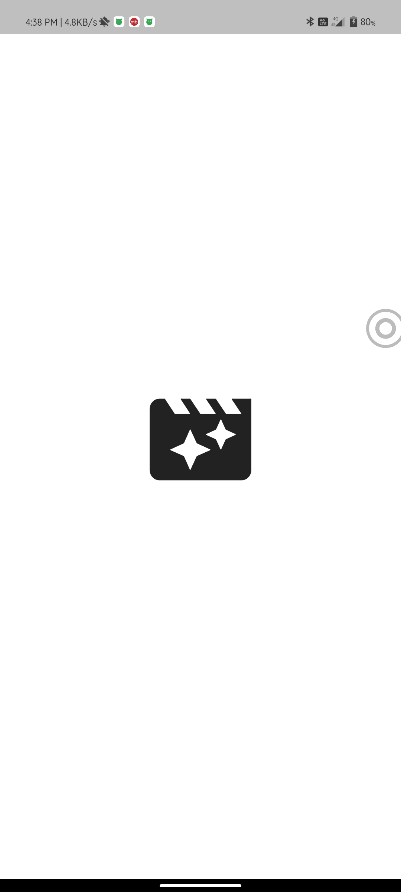
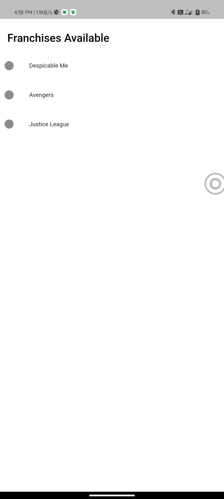
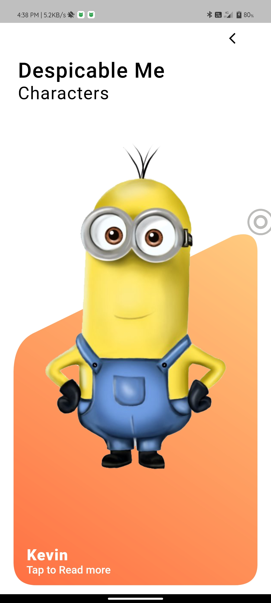
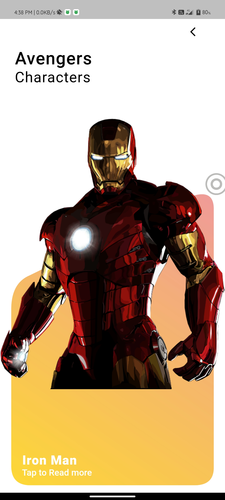
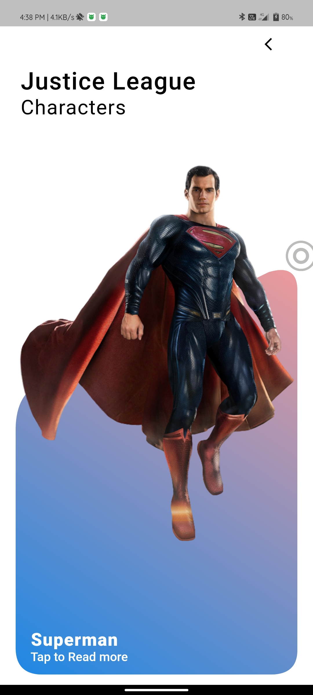
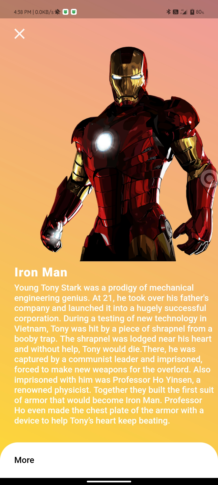
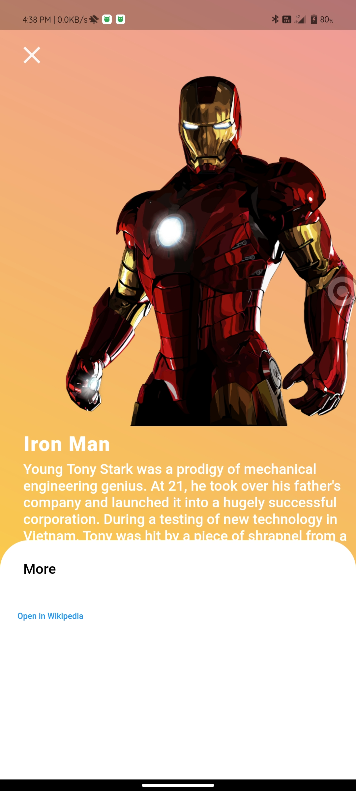

# character_app

Replace the android xml file in android>app>src.
Added Despicable me,Avengers and Justice League characters.
Replace the all given files in your project and it will work.
Similiar pages are for all characters with their respective suited gradients.

# App screenshots:

